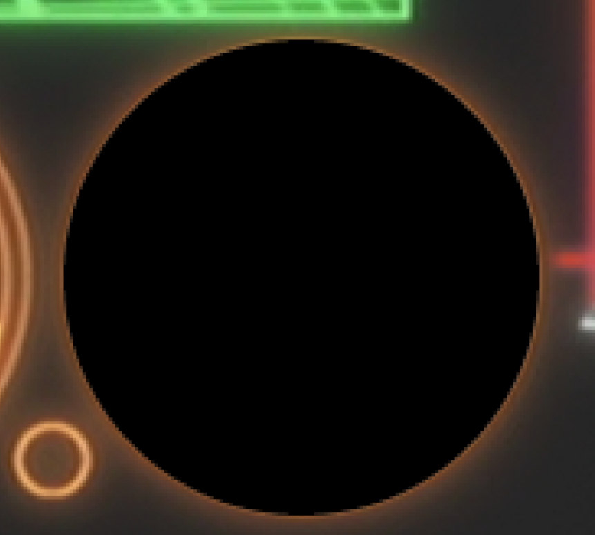

# DVD Remuxing

This guide can be used to remux DVDs using MPC-HC, FFmpeg, VapourSynth, and MKVToolNix.

!!!
Assistance is available in [this Discord server](https://discord.gg/XTpc6Fa9eB) if required.
!!!

## Required

1. [MPC-HC](https://github.com/clsid2/mpc-hc/releases)
2. FFmpeg >=7.0 GPL build from [BtbN](https://github.com/BtbN/FFmpeg-Builds/releases)
   - [Quick link for Windows x64](https://github.com/BtbN/FFmpeg-Builds/releases/download/latest/ffmpeg-n7.0-latest-win64-gpl-7.0.zip)
3. [VapourSynth](https://github.com/vapoursynth/vapoursynth/releases)
   - [Setup guide](https://jaded-encoding-thaumaturgy.github.io/JET-guide/setup/)
4. [MKVToolNix](https://mkvtoolnix.download/downloads.html)

## Finding Title/Angle/Chapter (MPC-HC)

DVDs can be split into Titles, Angles, and Chapters.
A title can be seen as a playlist
(or group of playlists if the disc has multiple angles).
Angles are used for many things,
from switching between different editions of the video (Broadcast / Home Video, Theatrical / Director's Cut),
to switching between English and Japanese Credits/Typesetting.
Note that each angle may have it's own set of chapters.
The simplest way to find all 3
for the episodes you are trying to remux
is to use MPC-HC
(mpv and VLC lack these capabilities).

1. Mount your ISO/insert your DVD.
2. In MPC, click _File > Open DVD/BD_ and select the root directory of the DVD or folder containing VIDEO_TS.

!!!
You can click _Navigate > Title Menu_ to skip the trailers/warnings and get to the Menu.
!!!

Once you are in the DVD Menu,
you should be able to navigate to all the episodes.
You will need to take note of a few things
about the particular disc you are remuxing.

- Find out if the disc has multiple angles. You can change the current angle by going to _Play > Video Angle_
- Find out if the episodes are all in 1 title, or if each episode has its own title. You can view the current title by going to _Navigate > Titles_
- If each episode does not have its own title, find out where the Chapter marks are for each episode. You can view the current chapter by going to _Navigate > Chapters_

## Checking for PCM

If your DVD has PCM Audio,
it needs to be converted to another format
during the remuxing process.
We can use ffprobe to check for PCM streams,
and to check their stream ids.
To do this, run the command:

```shell
ffprobe -f dvdvideo -title <title> -i <path_to_dvd>
```

Replace:

- \<title\> with the title number you got from MPC-HC. This will be an integer from 1-99.
- \<path_to_dvd\> with the path to the disc image, or the VIDEO_TS folder.

==- Example ffprobe output snippet

```shell
Input #0, dvdvideo, from 'D:\VIDEO_TS':
  Duration: 00:00:35.50, start: 0.000000, bitrate: N/A
  Stream #0:0[0x1e0]: Video: mpeg2video, yuv420p(tv, top first), 720x480, SAR 8:9 DAR 4:3, 29.97 fps, 29.97 tbr, 90k tbn
      Side data:
        cpb: bitrate max/min/avg: 9800000/0/0 buffer size: 0 vbv_delay: N/A
  Stream #0:1[0xa0](jpn): Audio: pcm_dvd, 48000 Hz, stereo, s16, 1536 kb/s
```

==-

In the example case,
there is one audio stream and it is PCM.
This stream will need to be converted
to another lossless format.
Since it is `Stream #0:1`,
the stream id is `1`.

## Remuxing

To remux,
you need the latest FFmpeg from the link above.
Other builds may not have the proper compile flags
to include DVD Demuxing support.

We need to build a ffmpeg command for you to use.
You can start with a base of:

```shell
ffmpeg -f dvdvideo -preindex True -title <title>
```

Replace \<title\> with the title you are looking to remux.
This will be an integer from 1—99\*.
If neither of the following apply to your disc,
skip to the end.

_\*Although 0 is a valid title number,_
_ffmpeg treats it the same as title 1._

==- DVDs with multiple angles

If you want to rip a non-default angle from the disc, add:

```shell
-angle <angle>
```

Replace \<angle\> with the angle number
you are looking to remux.
This will be an integer from 1—9.

==-

==- DVDs with multiple episodes per Title

If you have multiple episodes per title,
you need to add:

```shell
-chapter_start <start_chap> -chapter_end <end_chap>
```

Replace \<start_chap\> with the first chapter of the episode you are remuxing.
Replace \<end_chap\> with the last chapter of the episode, inclusive.
Both accept an integer from 1—99

If you are including the first or last chapter,
you can exclude the respective argument.

==-

### Final Piece

After you have added the rest of the required flags,
you can end the command with:

```shell
-i <path_to_dvd> -map 0 -c copy <filename>.mkv
```

==- DVDs with PCM Audio

If your disc has PCM Audio, add:

```shell
-codec:<stream_id> flac -compression_level 12
```

**After** `-c copy` in the final part of the command.

Replace \<stream_id\> with the stream id you got using ffprobe.
If you have multiple PCM streams,
add another one for each stream.
This will convert the PCM audio to FLAC, at the highest compression level (12).

==-

Replace:

- \<path_to_dvd\> with the path to the disc image or the VIDEO_TS folder.
- \<filename\> with what you would like the resulting file to be named.

Here is an example of a working command:

```shell
ffmpeg -f dvdvideo -preindex True -title 2 -angle 2 -chapter_start 4 -chapter_end 8 -i example.iso -map 0 -c copy -codec:1 flac test.mkv
```

## Correcting SAR/PAR

!!!
This step, while complicated,
is absolutely necessary for your DVD remux to playback correctly.
A remux that does not follow this process
(or follows it incorrectly)
is **broken**.
!!!

!!!
This process will require loading the remux into VapourSynth.
See the setup guide for details.
!!!

### Explanation

DVD videos are stored as what's known as anamorphic video.
This means that the video encoded on the disc
have a different aspect ratio
from how it is meant to be displayed.
NTSC discs store a 720x480 resolution
while PAL discs are 720x576,
and neither of these are exactly 4:3 or 16:9.

A [SAR (Sample aspect ratio) aka PAR (Pixel aspect ratio)](https://en.wikipedia.org/wiki/Pixel_aspect_ratio)
is applied to the image to stretch it to the intended aspect ratio.
DVDs were meant primarily for CRT displays,
which have [overscan](https://en.wikipedia.org/wiki/Overscan).
Overscan was accounted for in the discs
by having the [active area](https://en.wikipedia.org/wiki/Overscan#Overscan_amounts) be below 720 pixels,
so when the CRT stretches the image a second time
nothing important is cropped
and the extra stretch results in the true aspect ratio.
Modern displays have neither overscan,
nor do they stretch the image.
This means that without correction,
every DVD will be displayed wrong,
and we need to fix this for a remux.

### Heuristics to identify SAR/PAR

Figuring out the correct SAR/PAR
to correct for this issue
is not an exact science.
Over the years many different standards have been formed,
and figuring out which your DVD uses
is not an intuitive process.
The methods below will be most helpful for this process.

Heres a table of the most common standards you'll see on DVDs:

+++ NTSC

| DAR  | SAR/PAR   | Active Area |
| ---- | --------- | ----------- |
| 4:3  | 4320:4739 | 710.85x486  |
|      | 640:711   | 711x480     |
|      | 160:177   | 708x480     |
|      | 10:11     | 704x480     |
| 16:9 | 2560:2133 | 711x480     |
|      | 640:531   | 708x480     |
|      | 40:33     | 704x480     |

+++ PAL

todo

+++

While this isn't a comprehensive list of existing standards,
anything outside of this table is exceedingly rare.
If the aspect ratio you determined does not fall under one of these,
it is almost certainly **wrong**.

!!!
Standards go out the window with NTSC -> PAL or vice-versa conversions,
working with such DVDs should be done by correcting SAR/PAR of the original format source
then figuring out the transform to make the foreign DVD match.
!!!

==- 1. Faded column check

We can the size of black/faded out columns on the image's border,
as this can indicate the active area.


Here we have a frame from a DVD.
We can see that the left and right borders have a fade to black.
If you look closely,
the left border has a fade of 5 pixels,
while the right has a fade of 4 pixels.
720 - (5 + 4) = 711,
so we now have a rough estimation of the active area.
Note that the fade on each border can often be off by +-1 pixel,
so we still need to verify this later.

Sometimes DVDs may have the faded columns variable per scene,
just going with what appears on the majority of the video is a safe bet.

!!!
NTSC has a standard which specifies an active area of 710.85x486,
which is extremely similar to 704x480.
A good assumption to make
is that if the disc comes from an analog transfer,
it's more likely to use the 710.85x486 active area.
This check will not be enough to clearly identify the two apart.
!!!

To increase our confidence in these results,
we can combine them with other methods.
==-

==- 2. Circle check

We can find an object meant to be a circle
and check which standard results in a perfect circle.

This one is pretty simple.
You find an object that you believe is meant to be a perfect circle
and compare different known SAR/PAR standards to a perfect circle
that you've overlaid in an image editor.



An example of an exact match using a SAR/PAR of 2560:2133 (711x480 active area).
==-

==- 3. Text/logo check

We can check text or studio logos
against a ground truth
(as many studio logos can be found in square pixel form).

More or less the same thing as the circle method,
but we use a studio logo instead.


This show ended up having a SAR/PAR of 4320:4739 (710.85x486 active area),
a difference the faded column check would be unable to determine.
==-

==- 4. Ground truth check

We can compare the DVD to a natively square pixel source (**Upscales do not qualify**).

This method is mainly for episodes
that were only released on DVD
when Blu-rays exist for other episodes,
such as DVD-only OVAs.
You can downscale the Blu-ray to 864x486,
crop it to 864x480,
and then apply different SAR/PAR standards
until the DVD matches the Blu-ray.
==-

In order to apply a SAR/PAR transform to check using these methods,
refer to this VapourSynth code snippet:

```py
from vstools import Sar, mod2
from vskernels import Bicubic

new_sar = Sar.from_ar(<dar_num>, <dar_den>, <active_width>, <active_height>)

if new_sar > 1:
    width, height = clip.width * float(new_sar), clip.height
elif new_sar < 1:
    width, height = clip.width, clip.height / float(new_sar)

clip_resized = Bicubic.scale(clip, mod2(width), mod2(height), keep_ar=True, sar=new_sar)
```

Replace:

- \<dar_num\> with the DVD's DAR numerator.
- \<dar_den\> with the DVD's DAR denominator.
- \<active_width\> with the SAR/PAR standard's active width.
- \<active_height\> with the SAR/PAR standard's active height.

Once you've determined the correct SAR/PAR,
we can print out the new display dimensions
to use with mkvpropedit like so:

```py
print(new_sar * clip.width / clip.height)
```

### Applying the corrected SAR/PAR

Once we've obtained these new display dimensions,
we can edit the mkv with the following terminal command:

```shell
mkvpropedit <filename>.mkv --edit track:v1 --set display-unit=3 --set display-width=<display_width> --set display-height=<display_height>
```

Replace:

- \<filename\> with the filename of your remuxed mkv.
- \<display_width\> with the new display width value you obtained.
- \<display_height\> with the new display height value you obtained.

This command is incomplete, however.
In order for fully correct playback
we need to set additional cropping flags
so the video is cropped to its respective active area.
This can be done by adding the following to the above command:

```shell
--set pixel-crop-left=<crop_left> --set pixel-crop-right=<crop_right>
```

Replace:

- \<crop_left\> with the necessary left crop (in number of pixels).
- \<crop_right\> with the necessary right crop (in number of pixels).

The crop values here should crop the original 720 width
to the active area of the SAR/PAR standard you are applying.
If your active width is odd, one of the borders will have
more black/faded columns.

If your disc has black borders on the top or bottom,
you should additionally set the top/bottom pixel crop flags.

Below is an example of a complete command (for a 16:9 video with active area 711x480 and a top black bar):

```shell
mkvpropedit test.mkv --edit track:v1 --set display-unit=3 --set display-width=1280 --set display-height=711 --set pixel-crop-left=5 --set pixel-crop-right=4 --set pixel-crop-top=4
```

After this your SAR/PAR correction is done and the DVD remux is complete.
